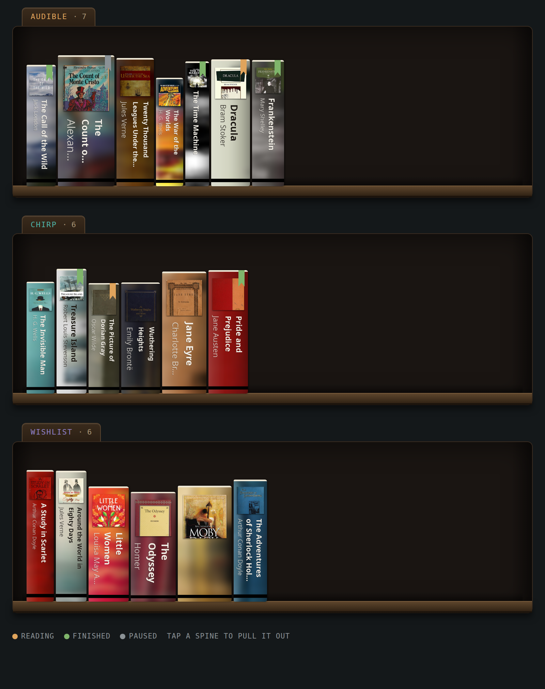
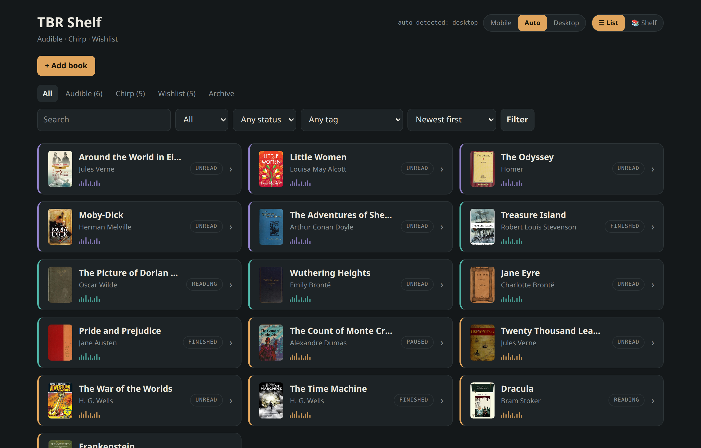
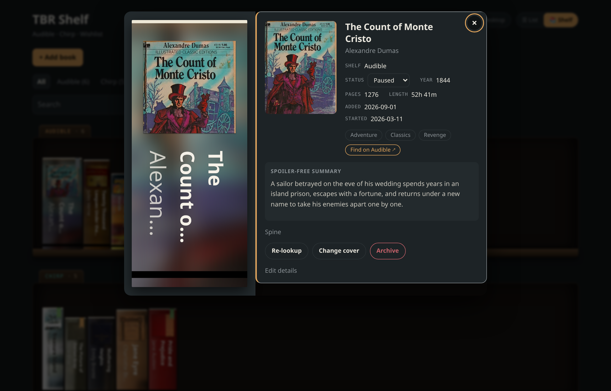
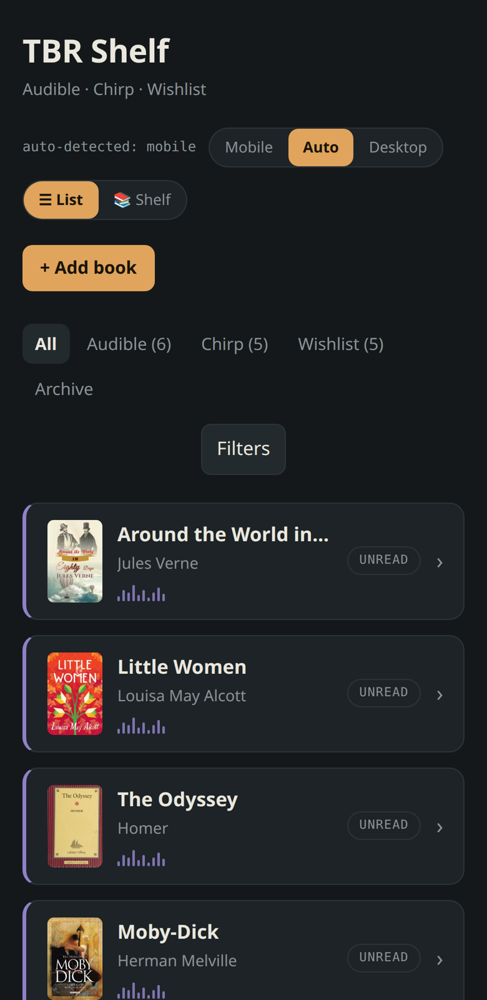
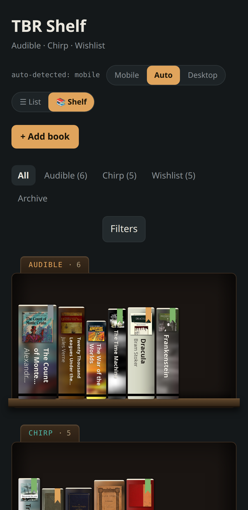

# TBR Shelf

A self-hosted reading tracker for people whose library lives in audiobook apps.
It keeps your Audible and Chirp libraries and a wishlist on one page, resolves
metadata and cover art from three catalogs, renders your books as spines on a
wooden shelf, and, if you point it at a language model, summarizes each book
without spoilers and lets you *talk* to a librarian who knows exactly what is on
your shelf.



One Python process, one SQLite file, no build step. Every AI feature is optional
and the tracker is complete without any of them.

## What it does

- **Three shelves, one page.** Audible, Chirp and Wishlist, with status
  (Unread / TBR / Reading / Finished / Paused), series, tags, notes, start and
  finish dates, and deep links that open the book in the store or the app. A
  **TBR** tab gathers the books you've marked as up next from every shelf, and
  an open book has previous/next controls so you can walk the list without
  closing it.
- **Search as you type.** The search box filters the page as you type, across
  title, author, narrator, series and tags, with one tap to clear; the shelf view
  follows. Tags are picked from a typeahead instead of a long dropdown.
- **And past it.** When nothing on the page matches, Audible's keyword search
  runs below the list on its own; when something does, one tap runs it. Hits you
  already own show their status and open the tile; the rest add that exact
  edition with **+ Wishlist**, complete with narrator, runtime, cover and the
  publisher's summary, so no lookup runs for it. Every hit, and every book with
  an Audible edition, has a five-minute narration sample.
- **Metadata that never overwrites you.** Adding a title queries Open Library,
  Google Books and the Audible catalog in parallel. Blank fields are filled;
  existing ones are left alone. The Audible edition that agrees with your author
  supplies the store link, runtime and narrator. When the catalogs disagree with
  what you typed or can't find an exact match, the book is flagged for review
  with the candidates attached, and you pick. When you *want* the catalogs'
  current values, **Refresh data** on a book replaces its year, pages, format,
  runtime, narrator and store link, re-downloads the cover and rebuilds the
  cached sizes. It still never touches your title, tags, notes, series, or the
  cover you chose.
- **Covers are yours to choose.** The first cover is proposed once. After that,
  "Change cover" shows every candidate and every edition Open Library knows for
  the work, and you click the one you like.
- **A shelf you can browse.** Spines are rendered server-side from each cover
  (edge texture, curved shading, a thumbnail and a rotated title), sized from
  page count and print format so a doorstop looks like a doorstop. Tap a spine
  and the full record slides out. Status ribbons mark what you're reading.
- **Bring your own spine generator.** A small API lets an external process
  deliver real spine images with the book's physical dimensions; the shelf sizes
  the slot from those and you can flip between the local and external spine per
  book.
- **Optional AI, cleanly optional.** With an OpenAI-compatible chat endpoint
  (a local llama.cpp server, Ollama, vLLM, or a hosted API): spoiler-free
  summaries (the publisher's own copy when the book has an Audible ASIN, the
  model only when the catalog has nothing), "similar books" suggestions that
  are added only if you say so, and a voice librarian. With a speech endpoint:
  summaries read aloud. Unconfigured features hide their buttons and answer
  503; nothing breaks.
- **A librarian that only learns what you approve.** Voice chat runs
  speech-to-text locally, answers from the live library, and speaks the reply.
  Conversations are persisted for review, but the assistant's prompt only ever
  includes preference lines an operator wrote back through the preferences
  endpoint. It cannot quietly teach itself about you.
- **Imports that scale.** CSV for anything; a one-command importer for a whole
  Audible library that resolves each book by ASIN from the keyless catalog API,
  so 700 books arrive verified, with runtime, categories, cover art and the
  publisher's own summary, and queue zero background jobs.
- **Light on the wire.** The page ships one summary row per book and fetches
  the full record when you open it. Covers and spines are served as right-sized
  WebP derivatives cached beside the originals (the source files are never
  re-encoded), shelf spines load as they scroll into view, and responses are
  gzipped. A 760-book library opens at about 60 KB of HTML.
- **Safe to use from three devices at once.** Every write carries the version
  it read; a stale write gets a 409 and a reload prompt instead of clobbering a
  concurrent edit. Installable as a PWA on iOS and Android.

## Screenshots

| List view | Pulled-out book |
|---|---|
|  |  |

| Phone, list | Phone, shelf |
|---|---|
|  |  |

All screenshots use the demo library from `tools/seed_demo.py` (public-domain
titles, cover art from Open Library).

## Quick start

Requires Python 3.12+ and a TrueType font for spine rendering (Noto Sans,
DejaVu Sans or Liberation Sans; `fonts-noto-core` on Debian/Ubuntu).

```bash
git clone https://github.com/rh-pro-git/tbr-shelf.git
cd tbr-shelf
python3 -m venv .venv && . .venv/bin/activate
pip install -e .
tbr-shelf                      # http://127.0.0.1:8460
```

Try it with a demo library in a second terminal:

```bash
python tools/seed_demo.py      # 19 public-domain books with covers from Open Library
```

Or with Docker:

```bash
docker build -t tbr-shelf .
docker run -p 8460:8460 -v tbr-data:/data tbr-shelf
```

Add a book with the **+ Add book** panel, and metadata lookup runs in the
background until the tile refreshes. Or search for it: anything not on the page
can be added from Audible's catalog in one tap, already complete.

## Configuration

Everything is read from `TBR_*` environment variables (see `.env.example`).

| Variable | Default | Purpose |
|---|---|---|
| `TBR_DATA_DIR` | `./data` | SQLite file, cached covers, rendered spines, audio. |
| `TBR_LLM_URL` | unset | OpenAI-compatible chat-completions URL. Enables summaries, suggestions, voice. |
| `TBR_LLM_MODEL` | unset | Model name sent with each request. |
| `TBR_LLM_API_KEY` | `not-needed` | Bearer token, if the endpoint wants one. |
| `TBR_LLM_EXTRA_BODY` | disables "thinking" | Extra JSON merged into every chat request (llama.cpp/Qwen-style servers). |
| `TBR_TTS_URL` | unset | OpenAI-compatible `/audio/speech` URL (Kokoro-FastAPI, OpenAI). Enables "Listen" and spoken replies. |
| `TBR_TTS_MODEL` / `TBR_TTS_VOICE` | `kokoro` / `af_heart` | Passed through to the speech endpoint. |
| `TBR_STT_MODEL` | `small` | faster-whisper model size for voice chat (`pip install 'tbr-shelf[voice]'`). |
| `TBR_REQUEST_TIMEOUT_S` | `180` | Outbound timeout; generous so an idle local model can load. |
| `TBR_FONT_DIR` | unset | Directory holding `NotoSans-*.ttf` if not in a standard location. |

`GET /healthz` reports the schema version and which features are live.

## Importing a library

**CSV.** Use the *Import CSV* button or `POST /api/import/csv`. Only `title` is
required; `author`, `series`, `shelf`, `status`, `tags`, `notes`, `year`,
`page_count`, `audiobook_length`, `date_added`, `started_at`, `finished_at` and
`store_url` are recognized, case-insensitively. Rows are deduplicated against
the library by title, author and shelf, then queued for lookup.

**Audible.** Export your library with the
[Audible Library Extractor](https://github.com/joonaspaakko/audible-library-extractor)
browser extension, then:

```bash
python tools/import_audible_library.py "Audible Library Extractor Data.json" --dry-run
python tools/import_audible_library.py "Audible Library Extractor Data.json"
```

The extension's export is thin, but every row has an ASIN. The importer fetches
each book by ASIN from Audible's keyless catalog API, which is exact rather than a
title search, so rows land with year, categories, runtime, cover and the
publisher's summary already in place. Wishlist items go to the Wishlist shelf;
archived items and podcasts are skipped. Duplicates are detected by ASIN.

**Anything else.** `POST /api/import/books` accepts pre-enriched rows (see
`ImportedBook` in `models.py`) and queues only the cover fetch.

## External spine generators

No public catalog serves photographs of book spines, so TBR Shelf synthesizes
one from the cover. If you have something better (a photo pipeline, an image
model, a person with a camera), plug it in:

1. `GET /api/spine-queue` lists books whose spine was requested
   (`?all=1` adds every book that has none).
2. `PUT /api/books/{id}/spine-asset` with multipart fields `meta` (JSON) and
   `file` (PNG, ≤3 MB). Useful `meta` keys: `height_in`, `thickness_in`,
   `display_thickness_in` (a legibility-clamped thickness the shelf should use
   for the slot), `source_type`, `confidence`, `edition`, `isbn`, `notes`.
   Omit `file` to record a failure.

The shelf sizes the slot from the delivered dimensions and shows the external
spine whenever one is ready; each book's *Spine* panel lets you compare and
override.

## The librarian and the review loop

Voice chat needs `TBR_LLM_URL` and the `voice` extra (faster-whisper runs on the
CPU; the `small` model answers a short question in a few seconds). Replies are
grounded in a snapshot of the whole library, including the first line of your
notes, and scoped to books by prompt.

Conversations are stored. An external reviewer of your choosing can:

- `GET /api/voice/conversations`: closed or idle conversations not yet ingested,
  turns inline.
- `POST /api/voice/conversations/{id}/ingested`: mark one as processed.
- `PUT /api/voice/preferences` with `{"lines": [...]}`: the only way anything
  learned reaches the prompt.

That last step is deliberately manual. Whatever distills the conversations, a
script, a model, or you, has to write the result back through that door.

## Security posture

TBR Shelf is a **single-user application with no authentication**. Bind it to
loopback (the default) and reach it over a VPN, a tailnet, or a reverse proxy
that handles login. It makes outbound requests only to the catalogs named above
and to the model and speech endpoints you configure. Nothing in your library
leaves the machine except book titles and authors sent to those services, and
the library snapshot sent to your chosen model with each voice turn.

The books-only scope of the librarian is prompt steering, not a wall. Treat the
model endpoint as something you trust with your reading list.

## Development

```bash
pip install -e '.[dev]'
ruff check . && ruff format --check .
pytest -q
```

The test suite is hermetic: an autouse fixture refuses all outbound HTTP, and
every test gets its own data directory. See `docs/architecture.md` for the
module map and the decisions behind it.

## Limitations

- The main page is still one server-rendered document: the shelf is built in
  the browser from every book's tile, so every book is on the page. Each tile is
  only a summary row (its detail is fetched on open), which keeps a 760-book
  library at ~60 KB gzipped; it has not been tried in the thousands.
- **Refresh data** is per book. There is no library-wide refresh; a batch of
  hundreds of lookups would need throttling against Open Library.
- No authentication (see above).
- Google Books is rate-limited for keyless callers and frequently contributes
  nothing; Open Library and the Audible catalog carry the lookup.
- The search past the library, add-by-ASIN and the narration samples all come
  from Audible's keyless catalog API. There is no second source for what it
  lacks, and a title with no audiobook edition will not appear there.
- Local spines are plausible, not real. The external-asset API exists because
  "real" needs a source this project cannot ship.

## License

MIT. See `LICENSE`.
